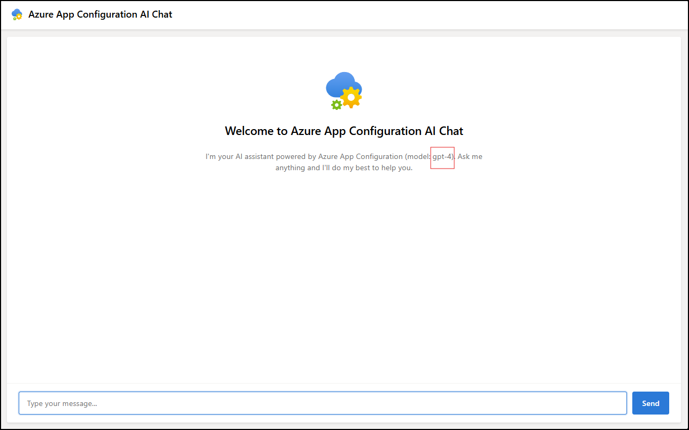

# AI Configuration Demo Application

This repository contains a demo application that showcases integration with Azure OpenAI services using Azure App Configuration for dynamic AI model configuration.




## Project Structure

- **Backend**: .NET API that integrates with Azure OpenAI
- **Frontend**: TypeScript/Vite application that provides a chat interface

## Prerequisites

- [.NET 8 SDK](https://dotnet.microsoft.com/download/dotnet/8.0)
- [Node.js](https://nodejs.org/) (v16+)
- [npm](https://www.npmjs.com/)
- Azure account with the following services:
  - Azure App Configuration
  - Azure OpenAI
  - Azure Key Vault

## Setup Instructions

### 1. Frontend Setup

1. Navigate to the Frontend directory:
   ```
   cd Frontend
   ```

2. Install dependencies:
   ```
   npm install
   ```

3. Build the project:
   ```
   npm run build
   ```

4. Start the development server:
   ```
   npm run dev
   ```
   The frontend will be available at `http://localhost:5173`

### 2. Backend Configuration

1. Update the `appsettings.json` file in the Backend directory:
   - Set the `AppConfig:Endpoint` property to your Azure App Configuration endpoint URL

2. Configure Azure App Configuration with the following settings:

   a. **AI Model Configuration**:
   - **Key**: `ChatLLM`
   - **Value**: 
     ```json
     {
       "model_provider": "azure_openai",
       "model": "{Azure Open AI deployment name}",
       "temperature": 0.7,
       "max_completion_tokens": 1000,
       "messages": [
         {
           "role": "system",
           "content": "You are a helpful Microsoft AI assistant. Be concise, professional, and informative."
         }
       ]
     }
     ```
     Replace `{Azure Open AI deployment name}` with your actual deployment name.
   - **Content Type**: `application/json`

   b. **Secondary AI Model Configuration**:
   - **Key**: `ChatLLM-2`
   - **Value**: 
     ```json
     {
       "model_provider": "azure_openai",
       "model": "{2nd Azure Open AI deployment name}",
       "temperature": 0.7,
       "max_completion_tokens": 1000,
       "messages": [
         {
           "role": "system",
           "content": "You are a helpful Microsoft AI assistant. Be concise, professional, and informative."
         }
       ]
     }
     ```
     Replace `{2nd Azure Open AI deployment name}` with your second deployment name.
   - **Content Type**: `application/json`

   c. **Azure OpenAI Endpoint**:
   - **Key**: `AzureOpenAI:Endpoint`
   - **Value**: `{Endpoint of Azure Open AI resource}`

   d. **Azure OpenAI API Key** (using Key Vault reference):
   - **Key**: `AzureOpenAI:ApiKey`
   - **Value**: 
     ```json
     {
       "uri": "{URI of Azure Key Vault secret containing Azure Open AI API key}"
     }
     ```
   - **Content Type**: `application/vnd.microsoft.appconfig.keyvaultref+json;charset=utf-8`

   e. **Feature Flag Configuration**:
   - **Feature Name**: `NewChatLLMVersion` (Feature Flag)
   - Configure this feature flag with targeting filter:
     - Target the user named 'jeff' directly
     - Ensure the flag is enabled
   - This flag controls which LLM configuration (ChatLLM or ChatLLM-2) is used by the application

### 3. Authentication Setup

The application uses `DefaultAzureCredential` for authentication, which requires either:

1. Authentication via Visual Studio / Visual Studio Code
2. Authentication via Azure CLI
3. Managed identity (for deployment scenarios)

Ensure you are logged in with an identity that has the following permissions:
- **Azure App Configuration**: App Configuration Data Reader role
- **Azure Key Vault**: Key Vault Secret User role for the key vault containing the OpenAI API key

#### Authentication Steps:

1. **Visual Studio Code**:
   - Install the Azure Account extension
   - Sign in using the Azure: Sign In command

2. **Azure CLI**:
   ```
   az login
   ```

### 4. Running the Application

1. Start the backend API:
   ```
   cd Backend
   dotnet run
   ```
   The API will be available at `https://localhost:7268`

2. Ensure the frontend is running (from step 1.4)

3. Navigate to `http://localhost:5173` in your browser to use the application

## Configuration Refresh

The application is configured to automatically refresh configuration settings from Azure App Configuration every 10 seconds, allowing real-time updates to AI model parameters without restarting the service.

## Troubleshooting

- **Authentication issues**: Ensure you're logged in with an account that has appropriate permissions
- **Key Vault access**: Verify that the identity used by DefaultAzureCredential has proper access to the Key Vault
- **CORS errors**: Ensure the backend is running and the frontend URL is properly configured in the CORS policy
- **Model errors**: Verify that your Azure OpenAI deployment name is correct and the model is available